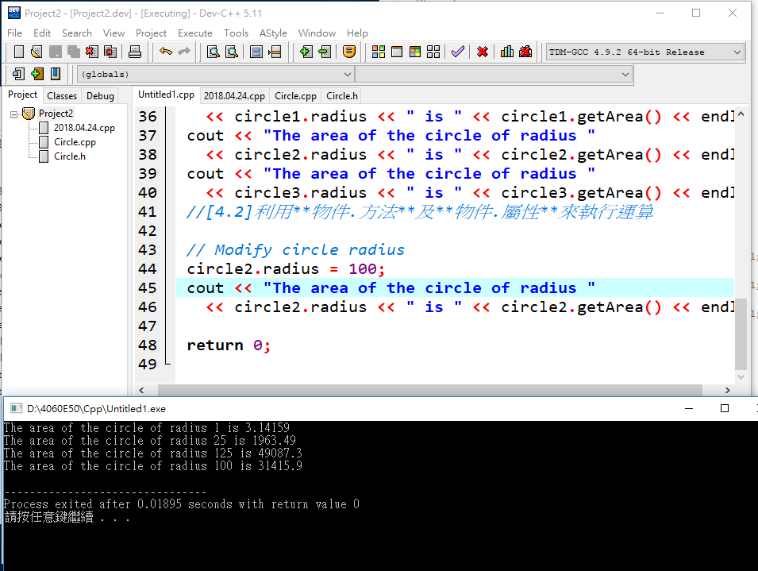
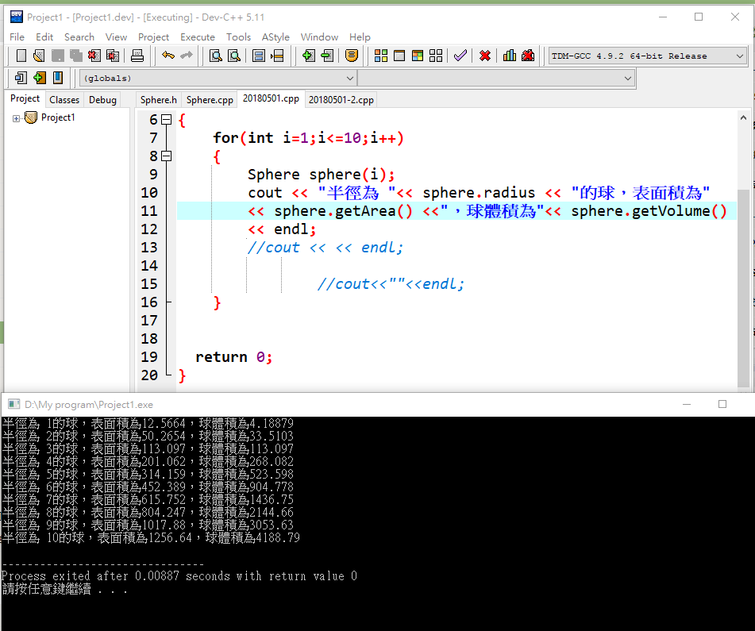

# 物件導向與面積
```
#include <iostream> //[1]載入相關模組
using namespace std; //[2]使用(標準)命名空間

class Circle //[3]建立類別class 類別class包括
{
public:
  // The radius of this circle
  double radius; //[3.1]屬性attribute:

  // Construct a default circle object
  Circle()//[3.2]建構子(CONSTRUCTOR):
  {
    radius = 1;
  }

  // Construct a circle object
  Circle(double newRadius)//兩個(含預設建構子DEFAULT)
  {
    radius = newRadius;
  }

  // Return the area of this circle
  double getArea()//[3.3]方法(METHOD/FUNCTION):
  {
    return radius * radius * 3.14159;
  }
};  // Must place a semicolon here

int main()//[4]main函式
{
  Circle circle1(1.0);
  Circle circle2(25);
  Circle circle3(125);//[4.1]用類別class建立三個物件

  cout << "The area of the circle of radius "
    << circle1.radius << " is " << circle1.getArea() << endl;
  cout << "The area of the circle of radius "
    << circle2.radius << " is " << circle2.getArea() << endl;
  cout << "The area of the circle of radius "
    << circle3.radius << " is " << circle3.getArea() << endl;
  //[4.2]利用**物件.方法**及**物件.屬性**來執行運算
  
  // Modify circle radius
  circle2.radius = 100;
  cout << "The area of the circle of radius "
    << circle2.radius << " is " << circle2.getArea() << endl;

  return 0;
}
```
## 執行結果

# 實作與定義分離(教科書9.6)
## 定義:Circle.h
```
class Circle
{
public:
  // The radius of this circle
  double radius;

  // Construct a default circle object
  Circle();

  // Construct a circle object
  Circle(double);

  // Return the area of this circle
  double getArea();
};
```
## 實作:Circle.cpp
```
#include "Circle.h"

// Construct a default circle object
Circle::Circle()
{
  radius = 1;
}

// Construct a circle object
Circle::Circle(double newRadius)
{
  radius = newRadius;
}

// Return the area of this circle
double Circle::getArea()
{
  return radius * radius * 3.14159;
}
```
## 主執行程式:
```
#include <iostream>
#include "Circle.h"
using namespace std;

int main()
{
  Circle circle1;
  Circle circle2(5.0);

  cout << "The area of the circle of radius "
    << circle1.radius << " is " << circle1.getArea() << endl;
  cout << "The area of the circle of radius "
    << circle2.radius << " is " << circle2.getArea() << endl;

  // Modify circle radius
  circle2.radius = 100;
  cout << "The area of the circle of radius "
    << circle2.radius << " is " << circle2.getArea() << endl;

  return 0;
}
```
## 執行結果

# 球體表面積&體積產生
## 定義:Sphere.h
```
class Sphere
{
public:
  //這個球型的半徑
  double radius;
  //構建一個默認的球型對象
  Sphere();
  //構建一個球形對象
  Sphere(double);
  //回傳表面積給這個球形
  double getArea();
  //回傳體積給這個球形
  double getVolume();
};
```
## 實作:Sphere.cpp
```
#include "Sphere.h"

Sphere::Sphere()
{
  radius = 1;
}

Sphere::Sphere(double newRadius)
{
  radius = newRadius;
}

double Sphere::getArea()
{
  return radius * radius * 3.14159* 4;
}

double Sphere::getVolume()
{
  return radius * radius * radius * 3.14159* 4 / 3;
}
```
## 主執行程式:
```
#include <iostream>
#include "Sphere.h"
using namespace std;

int main()
{
	for(int i=1;i<=10;i++)
	{
		Sphere sphere(i);
		cout << "半徑為 "<< sphere.radius << "的球，表面積為" 
		<< sphere.getArea() <<"，球體積為"<< sphere.getVolume()
		<< endl;
		//cout << << endl;
				
				//cout<<""<<endl;
	}


  return 0;
}
```
## 執行結果

