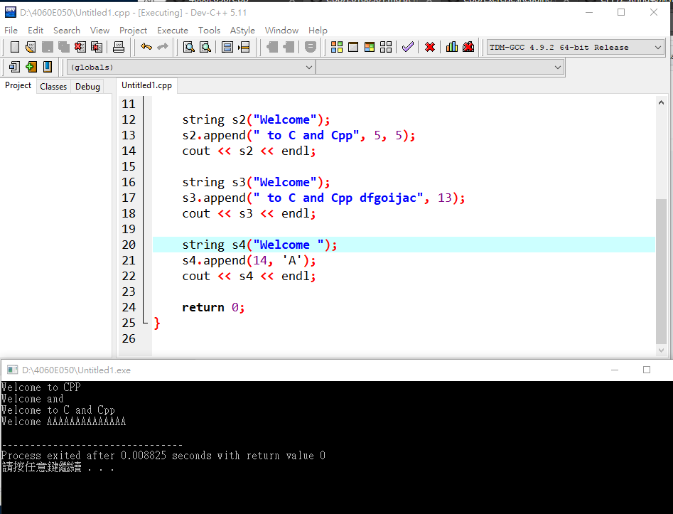

# 字串的附加
```
#include <iostream>
#include <string>
using namespace std;

int main()
{

	string s1("Welcome");
	s1.append(" to CPP"); 
	cout << s1 << endl; 
	
	string s2("Welcome");
	s2.append(" to C and Cpp", 5, 5); 
	cout << s2 << endl;
	
	string s3("Welcome");
	s3.append(" to C and Cpp dfgoijac", 13); 
	cout << s3 << endl; 
	
	string s4("Welcome "); 
	s4.append(14, 'A'); 
	cout << s4 << endl; 
	
	return 0;
}

```
## 執行結果

## [自我學習]
* http://www.cplusplus.com/reference/string/string/append/
```
#include <iostream>
#include <string>

int main ()
{
  std::string str;
  std::string str2="Writing ";
  std::string str3="print 10 and then 5 more";

  // used in the same order as described above:
  str.append(str2);                       // "Writing "
  str.append(str3,6,3);                   // "10 "
  str.append("dots are cool",5);          // "dots "
  str.append("here: ");                   // "here: "
  str.append(10u,'.');                    // ".........."
  str.append(str3.begin()+8,str3.end());  // " and then 5 more"
  str.append<int>(5,0x2E);                // "....."

  std::cout << str << '\n';
  return 0;
}
```
## 執行結果

## 從螢幕讀取字串
### 1.
```
#include <iostream>
#include <string>
using namespace std;

int main ()
{
	string city;
	cout << "Enter a city: ";
	cin >> city; // Read to array city
	cout << "You entered " << city << endl;
	
	return 0;
}

```
### 2.
```
#include <iostream>
#include <string>
using namespace std;

int main ()
{
	string city;
	cout << "Enter a city: ";
	getline(cin, city, '\n'); // Same as getline(cin, city)
	cout << "You entered " << city << endl;
	
	return 0;
}

```
## 顯示結果

## 作業2
### 從螢幕輸入姓名學號要顯示姓名學號
```
#include <iostream>
#include <string>
using namespace std;

int main ()
{
	string name;
	string number;
	
	cout << "輸入姓名、學號: ";
	cin >> name >>number;
	cout << "You entered " << name<<" " << number << endl;
	
	
	return 0;
}
```
## 顯示結果

