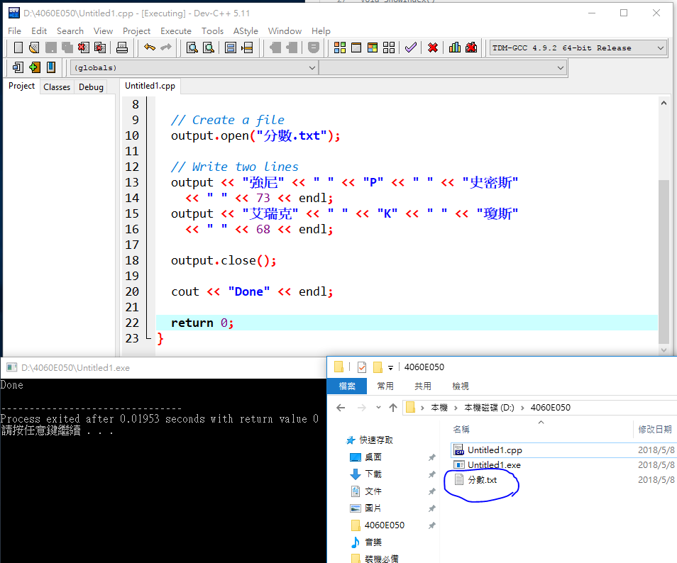
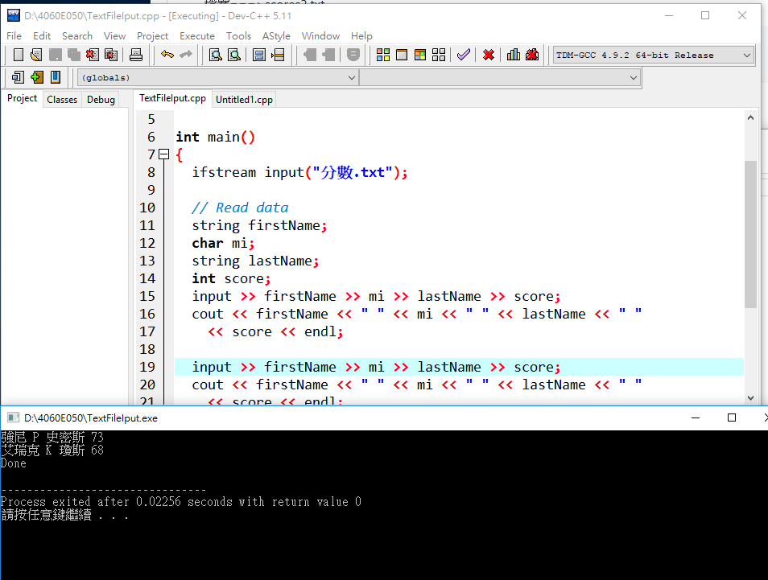

# CH:5
## 基礎函數(式)運用
```
#include <iostream>
using namespace std;
void ShowMessage(); //函式宣告語句
void ShowAge(); //函式宣告語句
void ShowIndex(); //函式宣告語句
int main()
{
	ShowMessage(); //函式呼叫語句
	ShowAge(); //函式呼叫語句
	ShowIndex(); //函式呼叫語句
	
	return 0;
}
void ShowMessage()
{
	cout << "Student徐芷喬" << endl;
	cout << "感謝龍大大" << endl;
}
void ShowAge()
{
	int iAge=19;
	cout <<"今年"<<iAge <<"歲" << endl;
}
void ShowIndex()
{
	int iIndex=54615;
	cout << "Index is :" << iIndex << endl;
}

```
## 顯示結果
運用.PNG)

# CH13:
## 檔案的輸入與輸出
### lab1:寫入資料於檔案 TextFileOutput.cpp
```
建立一 ofstream 的物件，並且寫入二行資料於 scores.txt 檔案。每一行資料包含名(字串)、中間名(字元)、姓(字串)以及分數(整數)。
```

```
#include <iostream>
#include <fstream>
using namespace std;

int main()
{
  ofstream output;

  // Create a file
  output.open("分數.txt");

  // Write two lines
  output << "強尼" << " " << "P" << " " << "史密斯" 
    << " " << 73 << endl;
  output << "艾瑞克" << " " << "K" << " " << "瓊斯" 
    << " " << 68 << endl;

  output.close();

  cout << "Done" << endl;

  return 0;
}
```
## 顯示結果


### lab2:從檔案讀出資料
#### 檔案===>分數.txt
```
強尼 P 史密斯 73
艾瑞克 K 瓊斯 68
```
#### 程式===>TextFileIput.cpp
```
#include <iostream>
#include <fstream>
#include <string>
using namespace std;

int main()
{
  ifstream input("分數.txt");

  // Read data
  string firstName;
  char mi;
  string lastName;
  int score;
  input >> firstName >> mi >> lastName >> score;
  cout << firstName << " " << mi << " " << lastName << " "
    << score << endl;

  input >> firstName >> mi >> lastName >> score;
  cout << firstName << " " << mi << " " << lastName << " "
    << score << endl;

  input.close();

  cout << "Done" << endl;

  return 0;
}
```
## 顯示結果

