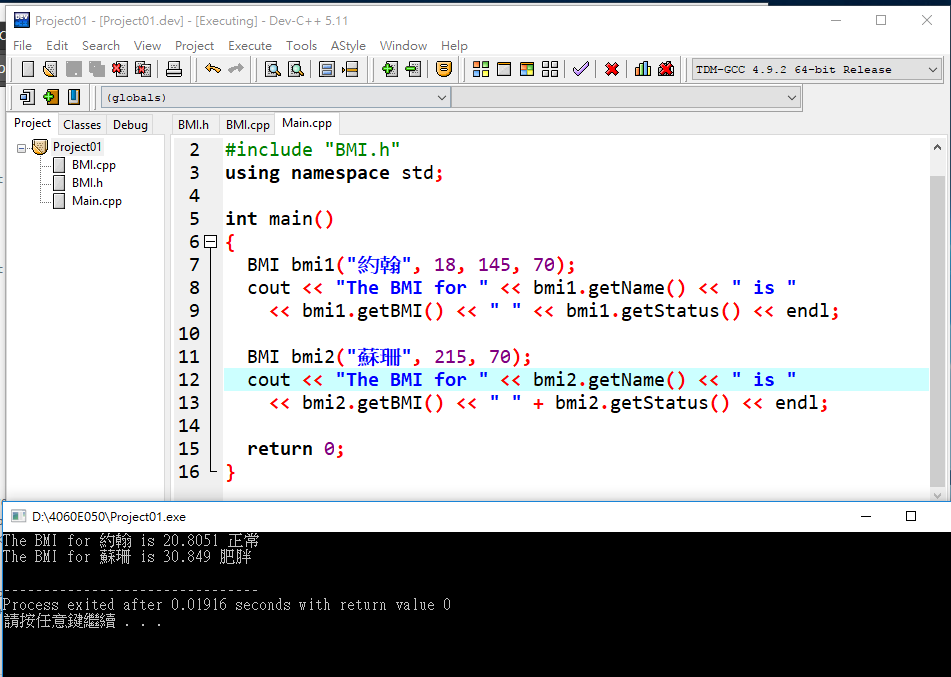

# String類別(Class)及其方法實測:
>* length()

>* size()

>* at(2)

>* front()

>* back()

>* begin()

>* end()

>* replace()

>* find()
```
#include <bits/stdc++.h> //載入標準的C++標頭檔
using namespace std;

int main()
{
	// various constructor of string class 不同的建構子

	// initialization by raw string 將字串設定初始值為"first string"
	string str1("first string");

	// initialization by another string 使用字串物件
	string str2(str1);

	// initialization by character with number of occurence 字串按照數字列印符號
	string str3(5, '#');

	// initialization by part of another string 字串使用物件(跳過6個數的字元,開始算6個數的字元)
	string str4(str1, 6, 6); // from 6th index (second parameter)
							// 6 characters (third parameter)

	// initialization by part of another string : iteartor version
	string str5(str2.begin(), str2.begin() + 5);

	cout << str1 << endl;
	cout << str2 << endl;
	cout << str3 << endl;
	cout << str4 << endl;
	cout << str5 << endl;

	// assignment operator
	string str6 = str4;

	// clear function deletes all character from string
	str4.clear();

	// both size() and length() return length of string and
	// they work as synonyms
	int len = str6.length(); // Same as "len = str6.size();"

	cout << "Length of string is : " << len << endl;

	// a particular character can be accessed using at /
	// [] operator
	char ch = str6.at(2); // Same as "ch = str6[2];"


	cout << "third character of string is : " << ch << endl;

	// front return first character and back returns last charcter
	// of string

	char ch_f = str6.front(); // Same as "ch_f = str6[0];"
	char ch_b = str6.back(); // Same as below
							// "ch_b = str6[str6.length() - 1];"

	cout << "First char is : " << ch_f << ", Last char is : "
		<< ch_b << endl;

	// c_str returns null terminated char array version of string
	const char* charstr = str6.c_str();
	printf("%s\n", charstr);

	// append add the argument string at the end
	str6.append(" extension");
	// same as str6 += " extension"

	// another version of appends, which appends part of other
	// string
	str4.append(str6, 0, 6); // at 0th position 6 character

	cout << str6 << endl;
	cout << str4 << endl;

	// find returns index where pattern is found.
	// If pattern is not there it returns predefined
	// constant npos whose value is -1

	if (str6.find(str4) != string::npos)
		cout << "str4 found in str6 at " << str6.find(str4)
			<< " pos" << endl;
	else
		cout << "str4 not found in str6" << endl;

	// substr(a, b) function returns a substring of b length
	// starting from index a
	cout << str6.substr(7, 3) << endl;

	// if second argument is not passed, string till end is
	// taken as substring
	cout << str6.substr(7) << endl;

	// erase(a, b) deletes b character at index a
	str6.erase(7, 4);
	cout << str6 << endl;

	// iterator version of erase
	str6.erase(str6.begin() + 5, str6.end() - 3);
	cout << str6 << endl;

	str6 = "This is a examples";

	// replace(a, b, str) replaces b character from a index by str
	str6.replace(2, 7, "ese are test");

	cout << str6 << endl;

	return 0;
}
```
# 類別(class)設計:BMI類別的設計 CH10-7
## BMI類別的定義 BMI.h
```
#ifndef BMI_H
#define BMI_H

#include <string>
using namespace std;

class BMI
{
public: //公開數據 
  // BMI類別帶參數 (名字字串,整數年齡,雙精準浮點數的體重,身高) 
  BMI(const string& newName, int newAge, double newWeight, double newHeight);
  // BMI類別帶參數 (名字字串,雙精準浮點數的體重,身高)  
  BMI(const string& newName, double newWeight, double newHeight);
  // 獲得雙精準的BMI值 
  double getBMI() const;
  // 用字串定義狀態
  string getStatus() const; 
  // 用字串獲得名字 
  string getName() const;
  // 獲得整數年齡 
  int getAge() const;
  // 獲得雙精準的體重身高 
  double getWeight() const;
  double getHeight() const;

private: //使公開數據用方法來獲得私人數據，非此方法無竄改 
  string name; 
  int age;
  double weight;
  double height;
};

#endif
```
## BMI類別的實作 BMI.cpp
```
#include <iostream>
#include "BMI.h"// 載入標頭檔BMI.h 
using namespace std;

// 用方法獲得名字、年齡等... 
BMI::BMI(const string& newName, int newAge, 
  double newWeight, double newHeight)
{
  name = newName;
  age = newAge;
  weight = newWeight;
  height = newHeight;
}
// 同上，但此類別用固定年齡 
BMI::BMI(const string& newName, double newWeight, double newHeight)
{
  name = newName;
  age = 20;
  weight = newWeight;
  height = newHeight;
}
//將獲得的數據做計算，後回傳值給BMI 
double BMI::getBMI() const
{
  const double KILOGRAMS_PER_POUND = 0.45359237;// 
  const double METERS_PER_INCH = 0.0254;
  double bmi = weight * KILOGRAMS_PER_POUND /
    ((height * METERS_PER_INCH) * (height * METERS_PER_INCH));
  return bmi;
}
//接受BMI值，去定義其狀態後回傳 
string BMI::getStatus() const
{
  double bmi = getBMI();
  if (bmi < 18.5)
    return "過輕";
  else if (bmi < 25)
    return "正常";
  else if (bmi < 30)
    return "過重";
  else
    return "肥胖";
}
//回傳名字 
string BMI::getName() const
{
  return name;
}
//回傳年齡 
int BMI::getAge() const
{
  return age;
}
//回傳體重 
double BMI::getWeight() const
{
  return weight;
}
//回傳身高 
double BMI::getHeight() const
{
  return height;
}
```
## 使用BMI類別 BMI.cpp
```
#include <iostream>
#include "BMI.h"
using namespace std;

int main()
{
  BMI bmi1("約翰", 18, 145, 70);
  cout << "The BMI for " << bmi1.getName() << " is "
    << bmi1.getBMI() << " " << bmi1.getStatus() << endl;

  BMI bmi2("蘇珊", 215, 70);
  cout << "The BMI for " << bmi2.getName() << " is "
    << bmi2.getBMI() << " " + bmi2.getStatus() << endl;

  return 0;
}
```
## 執行結果

