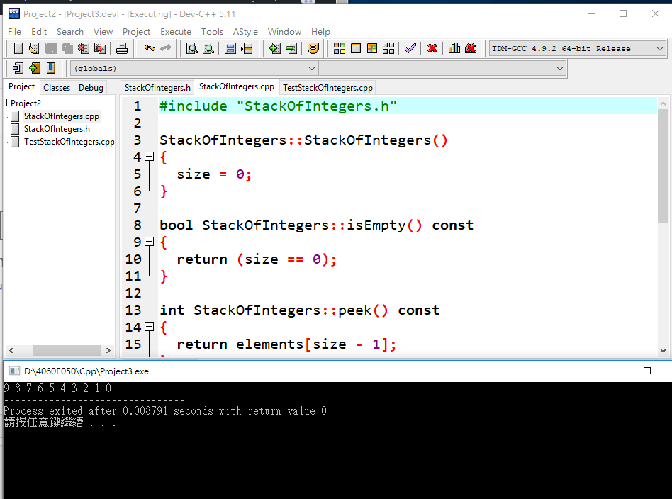

# class template類別樣版:
## 整數類型的stack
[1]定義 ==> StackOfIntegers.h
```
#ifndef STACK_H
#define STACK_H

class StackOfIntegers
{
public:
  StackOfIntegers();//預設建構值 
  bool isEmpty() const;//判斷堆疊是否為空 
  int peek() const;//計算此堆疊的頂點 
  void push(int value);//將要堆疊的數字丟給整數堆疊，不傳值 
  int pop();// 將堆疊的數字由頂點開始拔除 
  int getSize() const;//獲得此堆疊的大小 

private:
  int elements[100];//0~99共100個可以堆疊的整數空間 
  int size;//堆疊大小的值 
};

#endif
```
[2]實作==> StackOfIntegers.cpp
```
#include "StackOfIntegers.h"

//建立堆疊，預設為空(0) 
StackOfIntegers::StackOfIntegers()
{
  size = 0;
}

//判定此堆疊是否為空(是為空、否為實體) 
bool StackOfIntegers::isEmpty() const
{
  return (size == 0);
}

//計算堆疊的頂點，elements由0計算故-1 
int StackOfIntegers::peek() const
{
  return elements[size - 1];
}

//將整數丟給堆疊，使得將數字丟向當前的頂點後，elements+1 
void StackOfIntegers::push(int value)
{
  elements[size++] = value;
}

//從頂點將整數拔除後使element-1 
int StackOfIntegers::pop()
{
  return elements[--size];
}

//獲得此堆疊的大小後回傳 
int StackOfIntegers::getSize() const
{
  return size;
}
```
[3]使用==>TestStackOfIntegers.cpp
```
#include <iostream>
#include "StackOfIntegers.h"
using namespace std;

int main()
{
  StackOfIntegers stack;

  for (int i = 0; i < 10; i++)
    stack.push(i);

  while (!stack.isEmpty())
    cout << stack.pop() << " ";

  return 0;
}
```
## 運行結果

