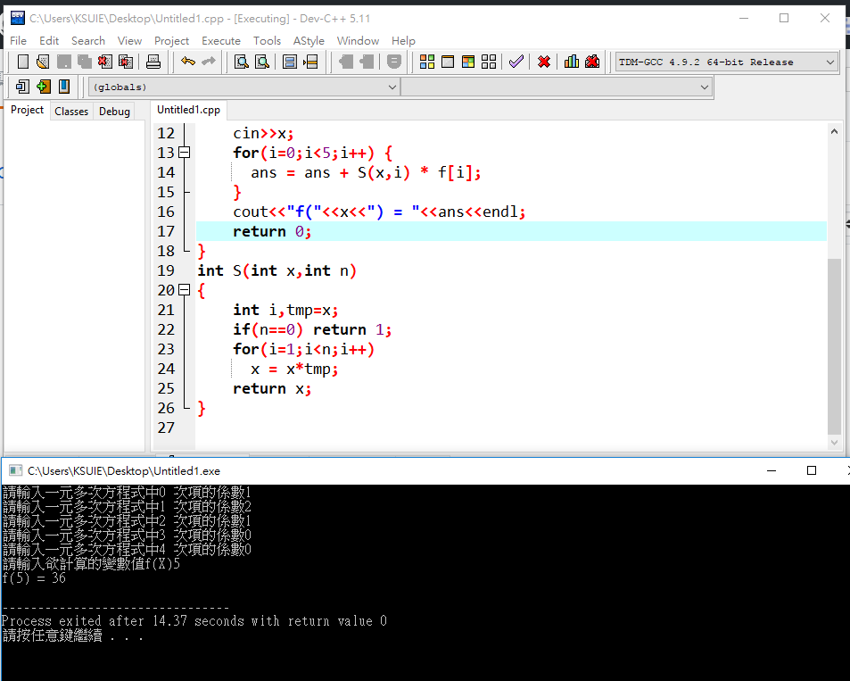

# 程式閱讀題(2018.4.17)
```
#include <iostream>
using namespace std;
int S(int,int);
int main(void)
{
    int i,f[5],x,ans=0;
    for(i=0;i<5;i++) {
      cout<<"請輸入一元多次方程式中"<< i <<" 次項的係數";
      cin>>f[i];
    }
    cout<<"請輸入欲計算的變數值f(X)";
    cin>>x;
    for(i=0;i<5;i++) {
      ans = ans + S(x,i) * f[i];
    }
    cout<<"f("<<x<<") = "<<ans<<endl;
    return 0; 
}
int S(int x,int n)
{
    int i,tmp=x;
    if(n==0) return 1;
    for(i=1;i<n;i++)
      x = x*tmp;
    return x;  
}


```


## ex.array_1:
```
#include <iostream>
using namespace std;
int main()
{
	int i,a[10];

	for(i=0;i<10;i++)
		a[i]=i;

	for(i=0;i<10;i++)
		cout << a[i] << endl;
		
    return 0;
}
```
